# IoT device data trend and visualization app

In this code pattern, we will setup and create a web application to visualize IoT device data and view trends and stats of device fields across days. The IoT industries are looking for ways to analyze the use of IoT devices, and would like better understand the usage of devices. This code pattern will demonstrate using IBM solutions to read and store IoT device data, and then build an application on top of it. The code pattern uses services offered on IBM Cloud such as IBM Watson IoT Platform and Cloudant DB, in addition to deploying the application to the IBM Cloud.  Once setup, the application displays the time-series field data as plots, showing device data trends and statistical analysis.

First, we will create an IBM Watson IoT Platform service which provides a platform to manage IoT devices and the data being sent across those devices.  This code pattern provides directions on creating dummy IoT devices in the Watson IoT Platform, and then simulating data for those devices using a simulation feature in the IoT platform.  We are interested in certain fields as part of payload for the devices to come through, as the application is designed to read those fields.

Next, we will store the devices' fields data from the Watson IoT platform into Cloudant DB.  The Cloudant DB is a NoSQL JSON document store that is optimized for handling heavy workloads of read and write in the cloud.  In this code pattern, we will walk through the process of creating a Cloudant DB service on the IBM Cloud, and retrieve credentials to access it through applications.  The Cloudant DB interface can be launched through the service, which allows to directly manage and view our data.  Once our Cloudant DB is created, we will go through steps on configuring Watson IoT Platform to store the IoT device data into it.

Once we have completed the setup, with our data coming through the Watson IoT Platform and into the Cloudant DB, we are ready to run the application to view the visualizations of data.  The application first requests the user to create a dataset based on the data now being stored in the Cloudant DB.  This can be viewed as our first layer of filtering assuming the IoT data scientist/analyst would like to focus on particular devices and dates. The device data could get large so it can be divided into different datasets for more focused analysis.

After creating a dataset, the user can use this application to create different visualizations for the data. This includes viewing the raw data for a device's data value across time, and then creating hourly trends plot that capture the behavior of the data per hour. The hourly trends looking at the max, min and moving average of the data which allows to capture the general trend of the field across time and capture any anomalies.  Other analytical plots include comparing device's field stats (min, median, max) across days and viewing correlation between fields for a device across days.  The Plotly.js library is used to create these visualizations of the data based on user inputs.  The Plotly.js provides a great way to display data visually through numerous plot types and ability to manage and enhance on plots.

This web application is built on Python Flask framework, with Javascript(JS) and HTML frontend.  The Python backend allows to create libraries (plotdata.py and dataset.py), which parse and analyze the JSON data from the Cloudant database. The frontend application provides a separate page for each plot type, and an associated JS script for each page in the `scripts` folder under `static` (i.e deviceCorrelationAnalysis.js).  The user inputs are sent through an Ajax call to the Python backend (run.py) which retrieves the respective data and returns it. This includes the data to be plotted, which is captured by the JS script for the page and shows how to plot using the Plotly.js library. These plots are then displayed through the HTML page for the plot.  

This code pattern can be useful to developer's looking to enhance IoT analysis skill, for IoT data scientists/analysts looking to create their own customized application, and anyone with interest in creating a visual analytical application.

When the reader has completed this code pattern, they will understand how to:

* Setup IoT devices on IBM Watson IoT Platform and simulate device's data
* Create Cloudant service on IBM Cloud, and using as data store for IoT device data
* Develop an application to parse JSON data from Cloudant DB using Python
* Display Plotly.js plots through a web application


## Architecture Flow

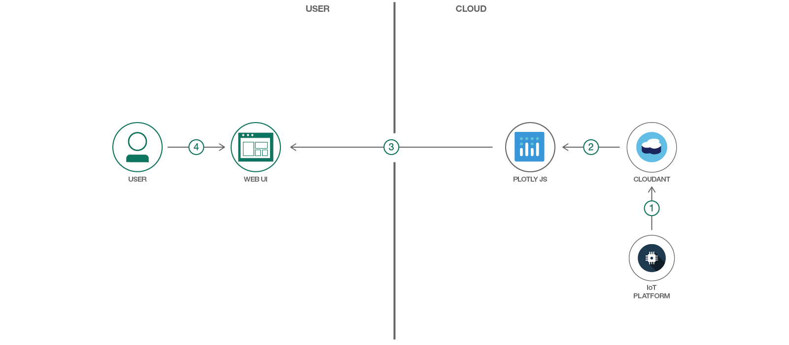

1. The IoT device data is stored in Cloudant database from the IBM Watson IoT Platform
2. The data from Cloudant database is used to create Plotly visualizatons
3. The plot is displayed through the Web UI based on user requests
4. The user can view the plots and perform analysis on each plot through the web UI


## Included Components

+ [IBM Watson IoT Platform](https://console.bluemix.net/registration/?target=/catalog/services/internet-of-things-platform): This service is the hub for IBM Watson IoT and lets you communicate with and consume data from connected devices and gateways. Use the built-in web console dashboards to monitor your IoT data and devices.
+ [Cloudant NoSQL DB](https://console.bluemix.net/catalog/services/cloudant-nosql-db): A fully managed data layer designed for modern web and mobile applications that leverages a flexible JSON schema.
+ [Plotly.js](https://plot.ly/javascript/): A high-level, declarative charting library with 20 chart types, including statistical graphs, 3D charts and SVG maps

## Featured technologies
+ [Python](https://www.python.org/) Python is a programming language that lets you work more quickly and integrate your systems more effectively.
+ [JavaScript](https://www.python.org/) JavaScript is a prototype-based, dynamic language, most well-known as the scripting language for Web pages

# Watch the Video

[](https://www.youtube.com/watch?v=AVD99LVwnKE)


# Steps

Use the ``Deploy to IBM Cloud`` button **OR** create the services and deploy the application locally.

# Deploy to IBM Cloud

You can deploy the application and create services directly on IBM Cloud using the 'Deploy to IBM Cloud' button.  This is alternative to creating services individually and then deploying the application using cloud foundry.

* Create an [IBM Cloud account](https://console.bluemix.net/registration/?target=%2Fdashboard%2Fapps) and directly deploy the application using the button bellow.  This will create the IBM Watson IoT Platform and Cloudant DB services for you and connect to your application.

[](https://bluemix.net/deploy?repository=https://github.com/IBM/iot-device-trend-analysis)

* Here you can provide your application and toolchain a name. You can choose the `Region`, `Organization` and `Space` where you would like to deploy the application. Then click `Deploy`.

<p align="center">
  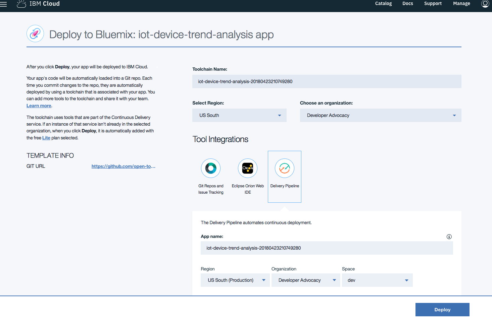
</p>

* Next, you can view your toolchain.  We can see the progress of deployment by clicking `Delivery Pipeline`.
<p align="center">
  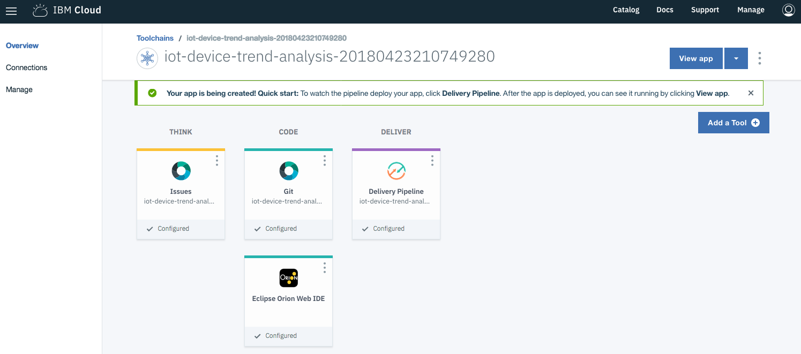
</p>

* The delivery pipeline will show the status of each stage.  You can view logs and history if any issues.  Once all stages pass, then your application has been successfully deployed.

<p align="center">
  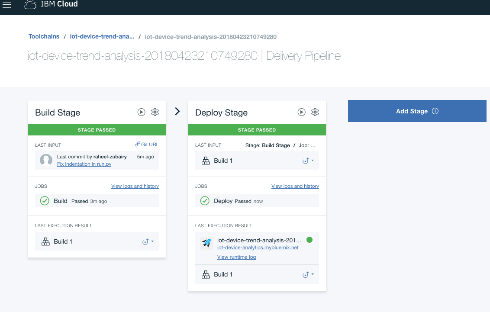
</p>

* In your IBM Cloud dashboard, you can now find your application.  You can open the application which provides an overview of the application as hosted in IBM Cloud.

<p align="center">
  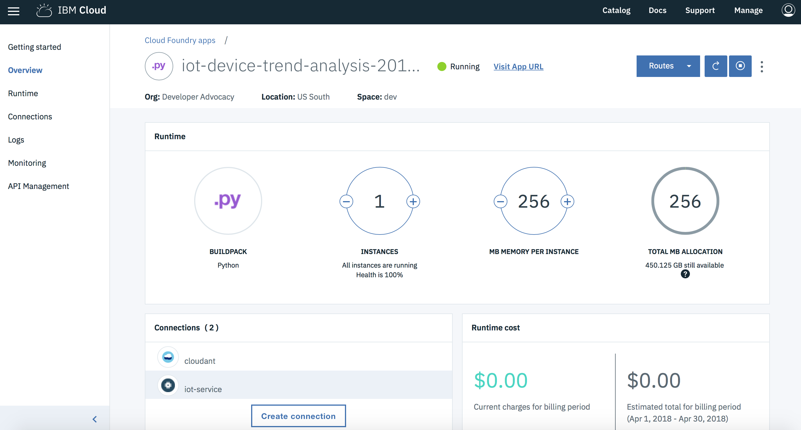
</p>

* You can view the services connected to this application by clicking `Connections` on the left menu.

<p align="center">
  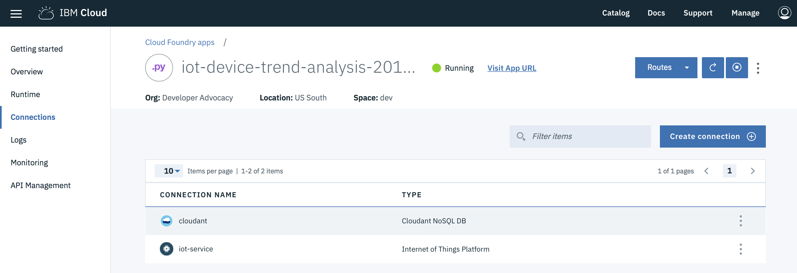
</p>

Once your application and services are created in IBM Cloud,  you will need to do the following to setup your IoT data in the Cloudant DB:
* [Create and simulate devices on IoT Platform](#2-create-and-simulate-devices-on-iot-platform)
* [Configure Cloudant DB as data store for IoT device data](#4-configure-cloudant-db-as-data-store-for-iot-device-data)

Or if you would like to use a sample dataset then proceed to this step:
* [Populate Cloudant DB with sample dataset](#4-option-2-populate-cloudant-db-with-sample-dataset)

Once you have completed these steps, you should be able to create dataset in your application to start viewing trends and analysis of the IoT device data.

# Run and deploy locally
> NOTE: These steps are only needed when running locally instead of using the ``Deploy to IBM Cloud`` button.

#### Prerequisites

- [Python](https://www.python.org/downloads/)
- [IBM Cloud account](https://console.bluemix.net/registration/?target=%2Fdashboard%2Fapps)
- [Cloud Foundary CLI](https://docs.cloudfoundry.org/cf-cli/install-go-cli.html)

#### Steps for setting up IBM Watson IoT Platform with Cloudant DB, and running the application
1. [Create IBM Watson IoT Platform service on IBM Cloud](#1-create-ibm-watson-iot-platform-service-on-ibm-cloud)
2. [Create and simulate devices on IoT Platform](#2-create-and-simulate-devices-on-iot-platform)
3. [Create Cloudant DB on IBM Cloud](#3-create-cloudant-db-on-ibm-cloud)
4. [Configure Cloudant DB as data store for IoT device data](#4-configure-cloudant-db-as-data-store-for-iot-device-data)
5. [Run the web application](#5-run-the-web-application)
6. [About the application](#6-about-the-application)
7. [Deploy application to IBM Cloud](#7-deploy-application-to-ibm-cloud)

#### Steps for populating Cloudant DB with sample dataset and running the application
3. [Create Cloudant DB on IBM Cloud](#3-create-cloudant-db-on-ibm-cloud)
4. (Option 2) [Populate Cloudant DB with sample dataset](#4-option-2-populate-cloudant-db-with-sample-dataset)
5. [Run the web application](#5-run-the-web-application)
6. [About the application](#6-about-the-application)
7. [Deploy application to IBM Cloud](#7-deploy-application-to-ibm-cloud)


## 1. Create IBM Watson IoT Platform service on IBM Cloud

The IBM Watson IoT Platform service provides a dashboard to manage and configure devices, read data transmitted by the devices and numerous features to managing IoT devices. First, we would like to create the IBM Watson IoT Platform service in IBM Cloud.

* You can access IBM Cloud by going to https://console.bluemix.net/. If you do not have an IBM Cloud account you can create one.

<p align="center">
  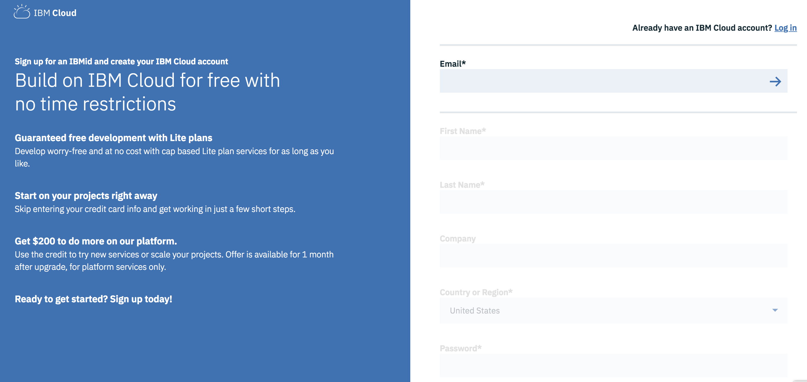
</p>

* If you do have an IBM Cloud account or have created on, then login to create the service.  You can search for the service in `catalog` and choosing `Internet of things`.  Here we would like to pick the `Internet of Things Platform`

<p align="center">
  
</p>


* Or alternatively can go directly to the [link here]((https://console.bluemix.net/registration/?target=/catalog/services/internet-of-things-platform)) to create the service.  Give your service a name and choose the `region`, `organization` and `space`.

<p align="center">
  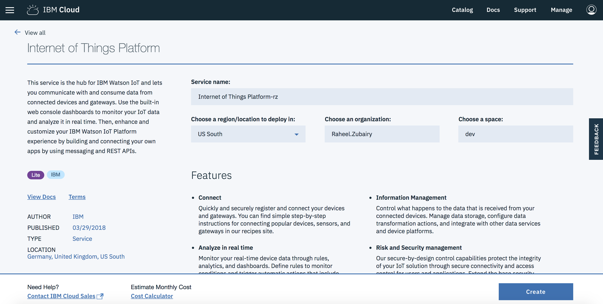
</p>

* You can pick the `Lite` plan for this code pattern to get started with Internet of Things Platform.  

<p align="center">
  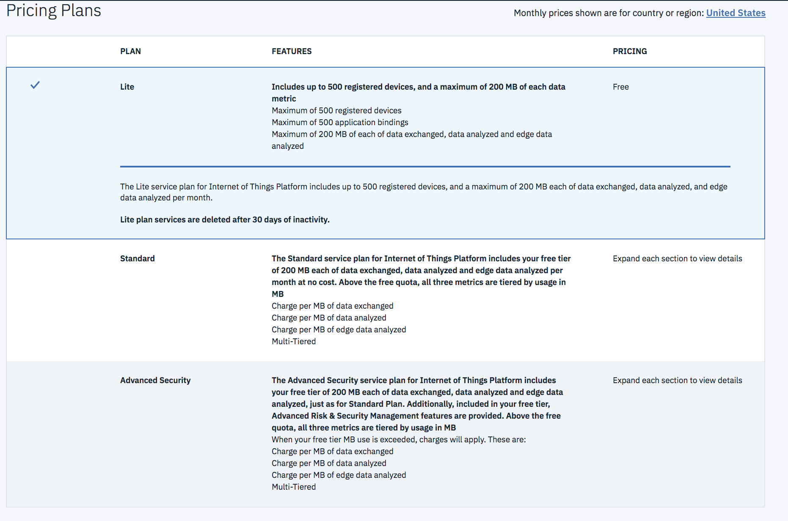
</p>

* Once your service is created, you can launch Watson IoT Platform by clicking the `Launch` button. Additionally, you can access documentation regarding the IoT Platform by going to `Docs` button.

<p align="center">
  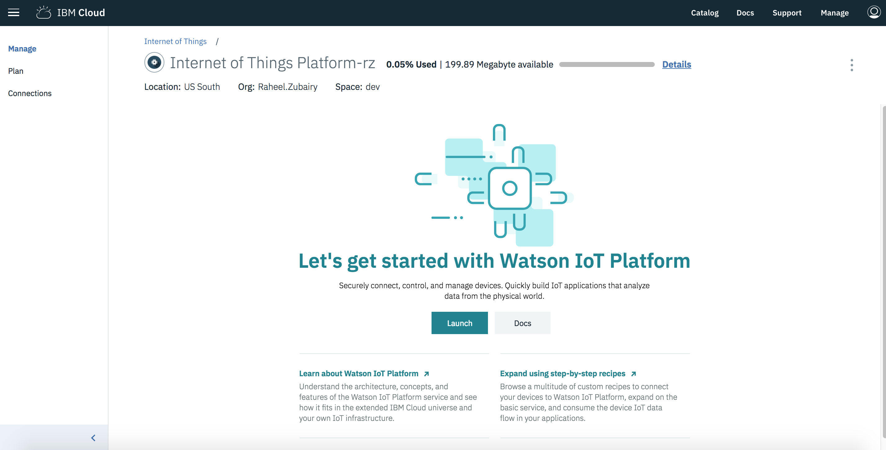
</p>

* Once your Watson IoT Platform, it should take you to a similar dashboard below.  Now you are ready to create devices and simulate data for the application.

<p align="center">
  
</p>


## 2. Create and simulate devices on IoT Platform

Once you have created your IBM Watson IoT Platform service, you are ready to setup devices to transmit data.  In this section, we will create a dummy device type, then create devices using the device type and then simulate data for those devices using the simulator feature in the IBM Watson IoT Platform.

The application in the code pattern is designed to handle payload as the following json:
```
  "deviceId": "d6a82126d",
  "timestamp": "2018-04-04T11:36:31.046Z",
  "data": {
    "connections": 58,
    "deviceCount": 78,
    "activeClients": 68
  }
```

The `deviceId` and `timestamp` are submitted automatically by the IoT Platform, however we would like to configure the devices to send data for `connections`, `deviceCount` and `activeClients`.  The application will plot and analyze these fields over time per device.

#### Add device type

Before creating devices, we would need to create a device type.  Device types are intended to be groups of devices which share common characteristics.  

* To add a `device type`, first go to the IBM Watson IoT Platform options on the left side of your dashboard and choose `Devices`.

<p align="center">
  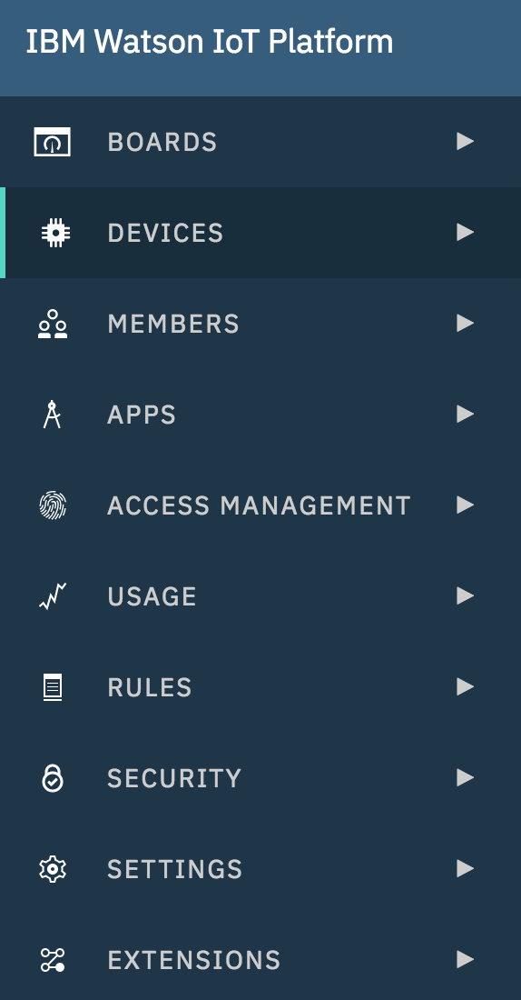
</p>


* Next, go to `Device Types` on your screen, and click the `Add Device Type` button on the top right.


<p align="center">
  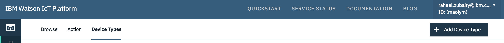
</p>


* Here we will go through options to create the device type.  Under the `Identity` tab, choose `Device` for type, as this code pattern is focued on devices. Provide a `Name` and an optional `Description`, and then click `Next`.

<p align="center">
  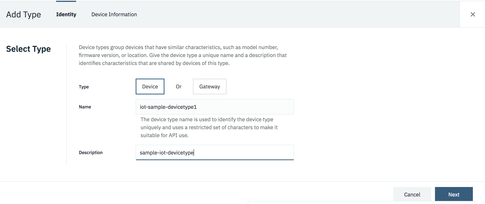
</p>

On the `Device Information`, you can add attributes to the device type.  These attributes are optional. Then click `Next` and `Done`.  The device type should be registered and you should see a similar screen as below.

<p align="center">
  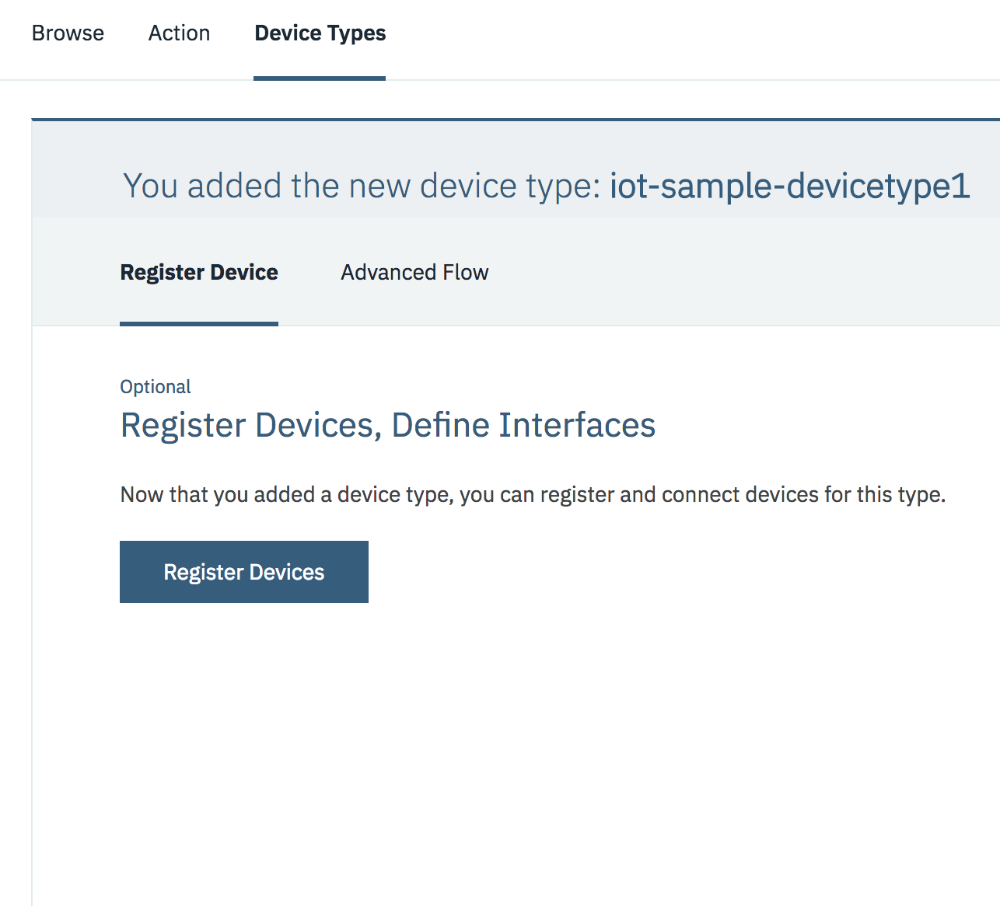
</p>


#### Add devices

Now, we will add device to the device type we created.

* You can choose `Register Devices` under your device type. Or go to `Devices` in the menu, and choose `Add Device` in the top right corner.

<p align="center">
  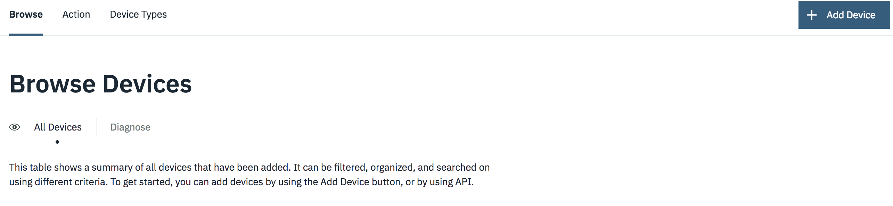
</p>

* In the `Identity` tab, choose the device type and provide a `Device ID`.  Then click `Next`.

<p align="center">
  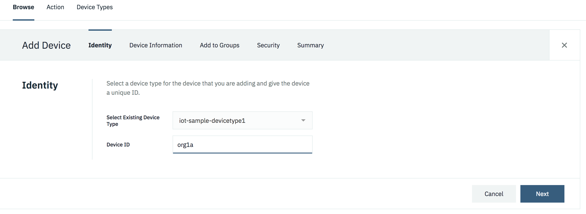
</p>

* You can choose to provide `Device Information` and `Add to Groups`.  You can go through the steps by clicking `Next`.  Under the `Security` tab, provide an `Authentication Token`.  Click `Next` and then `Done`.

<p align="center">
  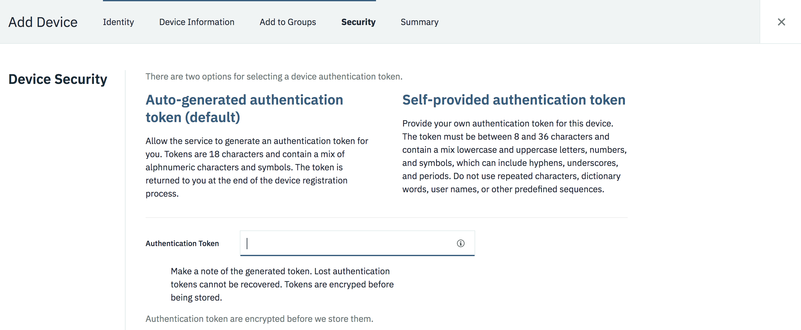
</p>

* Now your device is added to your IoT Platform.

<p align="center">
  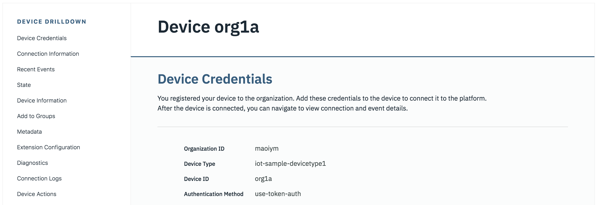
</p>


#### Simulate devices

Now we would like to setup our devices to transmit data.  Ideally you would to like read in real data or can have scripts to simulate the data (see `Additional Resources` at the bottom for more information).  For this code pattern, we will go through steps to simulate data sent through by the devices, using simulator feature part of the Watson IoT Platform dashboard.
The IoT Platform provides a simulator feature to simulate the payload transmitted by the device. In this step, we will turn on the simulator and simulate numbers for the fields to be transmitted by the device.  

* Go to the menu on the left side of your dashboard and select the `Settings` option:

<p align="center">
  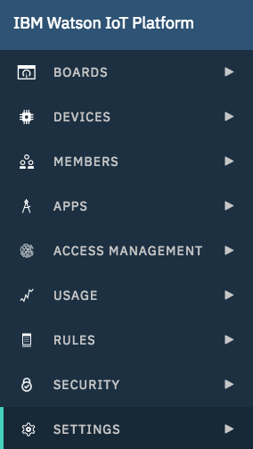
</p>

* Here scroll down to the `Experimental Features` section.  And toggle enable the `Active Device Simulator`.

<p align="center">
  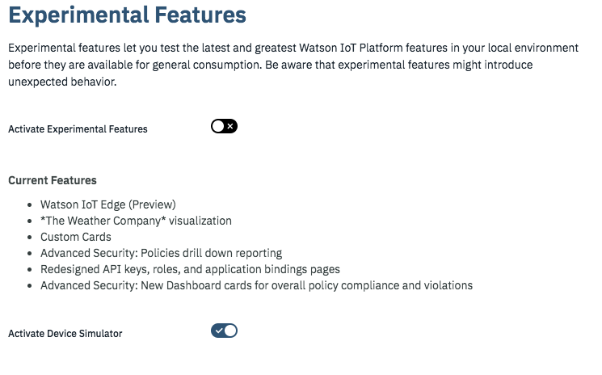
</p>

* Once you have enabled the simulation, you can update the payload and frequency of data sent by the device.  Look for `Simulations running` tab at the bottom of screen in your IoT Dashboard. Bring that up to create the simulation, by selecting `Add First Simulation`.

<p align="center">
  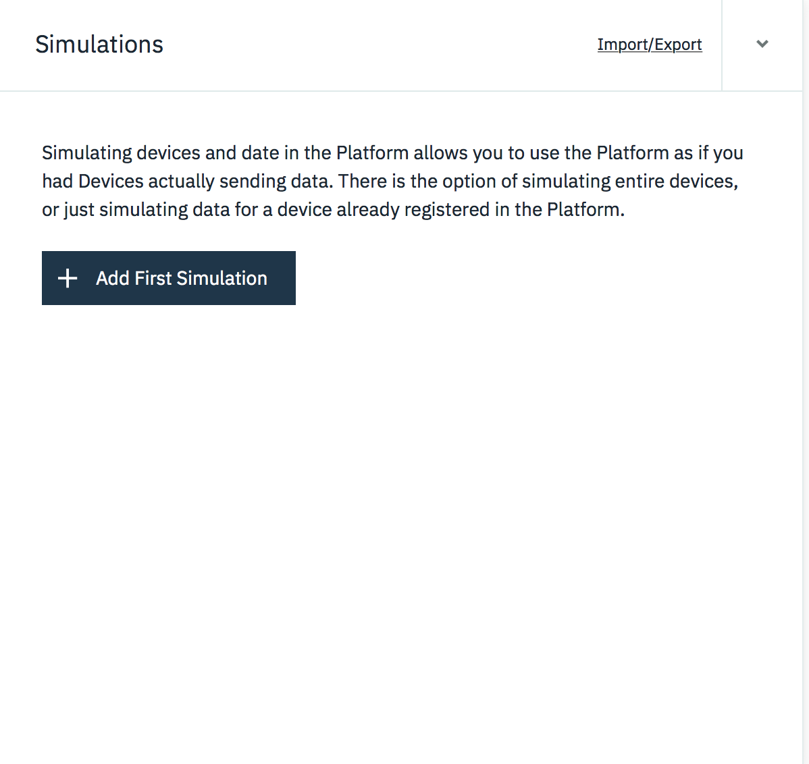
</p>


First choose a `Device Type`.  Next, we will define the `Payload` to include the fields for this code pattern: `connections`, `deviceCount` and `activeClients`.  The simulated data can look similar to below where it is generating random numbers for the fields, transmitting data every minute.  You can provide an `Event type name`.  Once done, click `Save`.

<p align="center">
  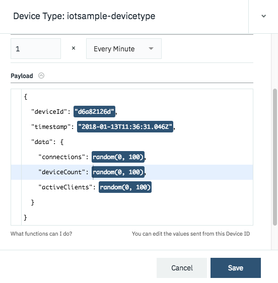
</p>

* Now for your device type, you can add devices for which you would like to run the simulation for.  Click the `dropdown` arrow next to your device type, and choose `Use Registered Device`.  Here you will see your devices and can choose the device you would like to simulate.

<p align="center">
  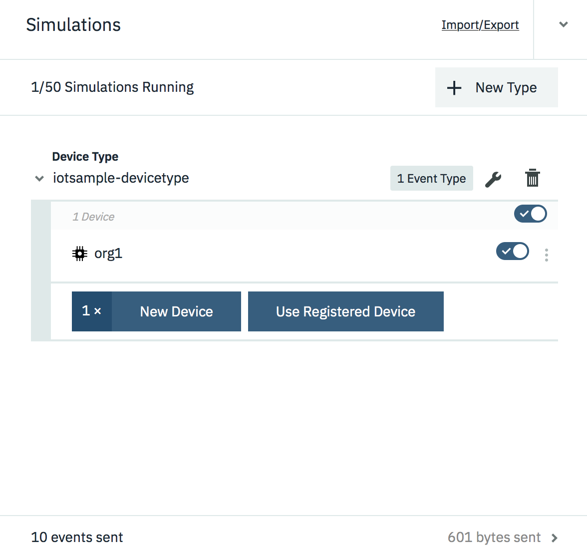
</p>

* To check your device simulation.  You can click on your device under `Devices`, and then go to the `Recent Events` tab.  Here you can view the live data being transmitted for the device.

<p align="center">
  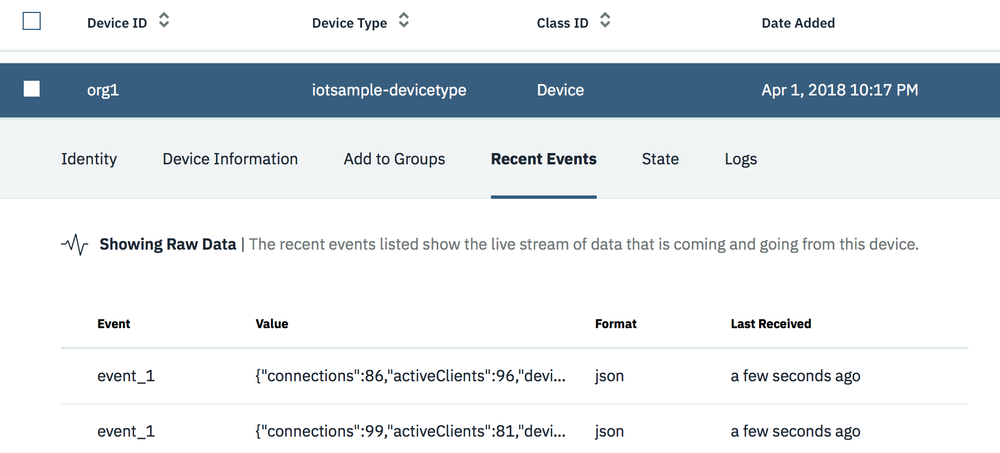
</p>


## 3. Create Cloudant DB on IBM Cloud

Now we are ready to store the IoT device data into a database.  The IBM Cloud provide several database options including relational and non-relational options.  For our data with the json payload, we would like to choose a NoSQL database such as Cloudant DB. The Cloudant DB provides for heavy read/write for an application, easy retrieval of data through API calls and a great interface to manage data directly. In this section, we will create a Cloudant DB on the IBM Cloud.

* Go to to your IBM Cloud dashboard.  You can go to `catalog` and under `Data & Analytics`, you can find `Cloudant NoSQL DB` service.

<p align="center">
  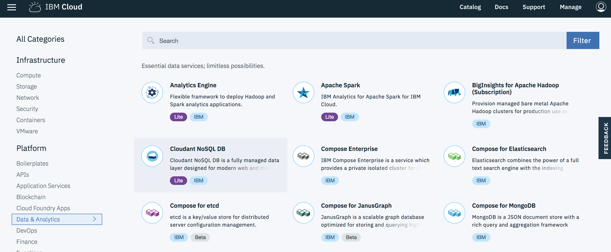
</p>

* Or you can go directly to the [service here](https://console.bluemix.net/catalog/services/cloudant-nosql-db) to create the Cloudant DB. Give your Cloudant DB a `Service name`, and then choose the `region`, `organization` and `space`

<p align="center">
  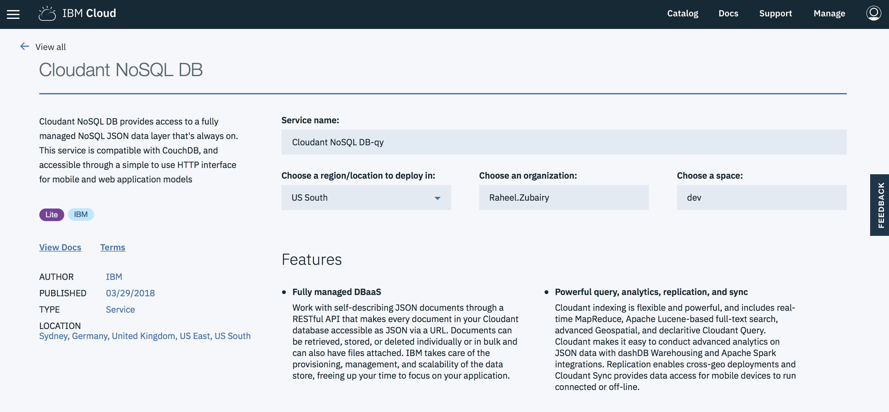
</p>

* You can pick from different plans, depending on the size of your data.  For this code pattern, we can use the `Lite` plan to get started.  Click `Create` at the bottom left to create the service in your IBM Cloud.

<p align="center">
  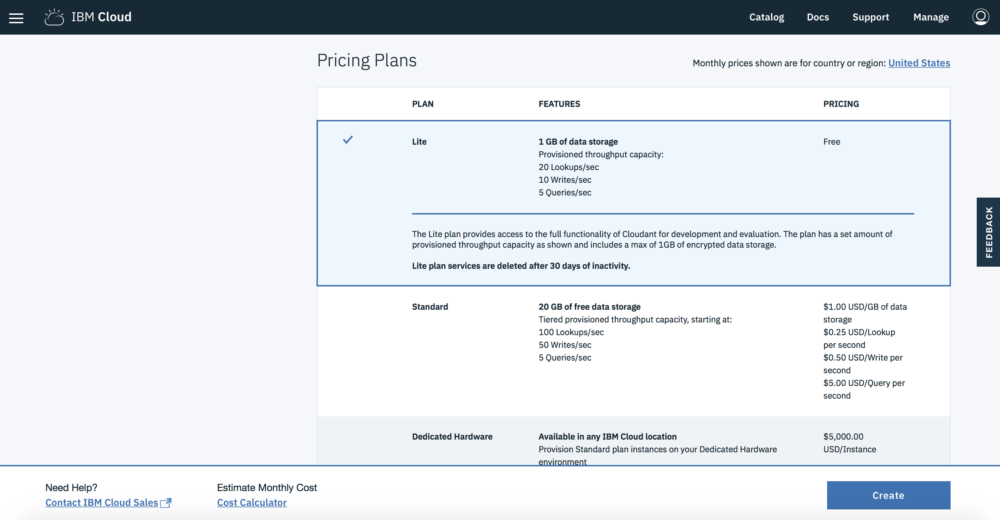
</p>

* This has now created the service.  Through this service, you can launch the Cloudant interface, retrieve credentials for the service and create connections to applications in your IBM Cloud.


<p align="center">
  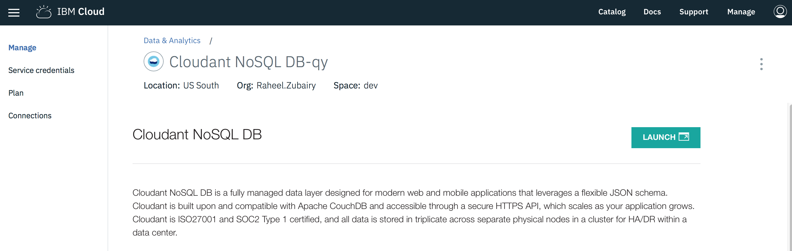
</p>


* To get service credentials, go to the `Service credentials` option on the left. Here you can generate credentials for the service by clicking on `New credentials`.  Go ahead and create credentials for the service as we will need those for our application.

<p align="center">
  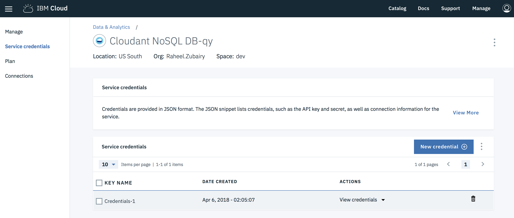
</p>


## 4. Configure Cloudant DB as data store for IoT device data

Now, we will configure our IBM Watson IoT Platform to setup Cloudant DB as daily store for our device data.  The IBM Watson IoT Platform provides a straight forward way to create daily buckets for our device data.  Once we are configured, we will have a database for each day in our Cloudant DB with our device data.

* In the IoT Platform, go to the menu and choose `Extensions`.

<p align="center">
  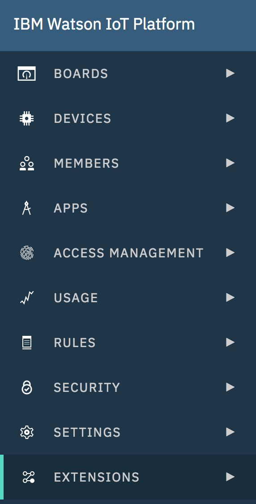
</p>

* Here, under `Historical Data Storage`, choose `Setup`.  Here you will see all your databases in your IBM Cloud. Find the Cloudant DB you created to store the device data.  

<p align="center">
  
</p>

* Next, set up your `Bucket Interval` for `Day` and then click `Done`

<p align="center">
  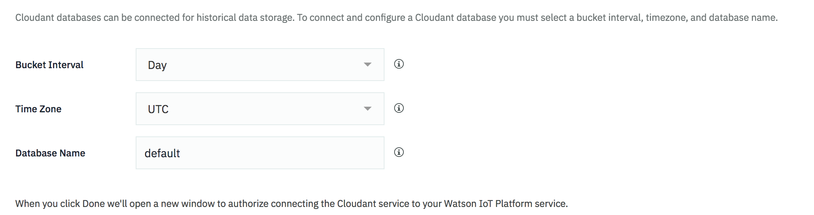
</p>

* Now your cloudant DB is set to receive data from Watson IoT Platform.  In your Cloudant DB, you should view a database for each day now:

<p align="center">
  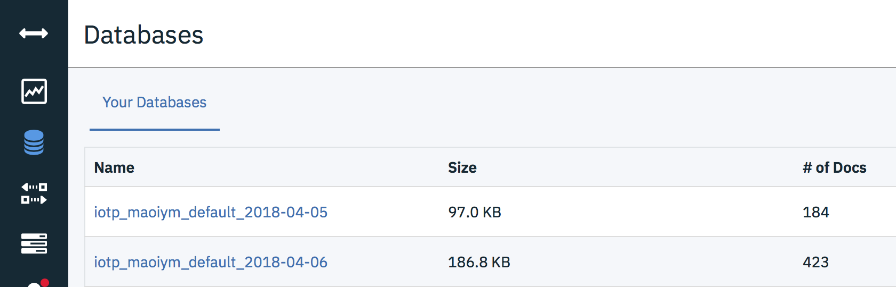
</p>

* You should view similar data in your Cloudant json as below:

<p align="center">
  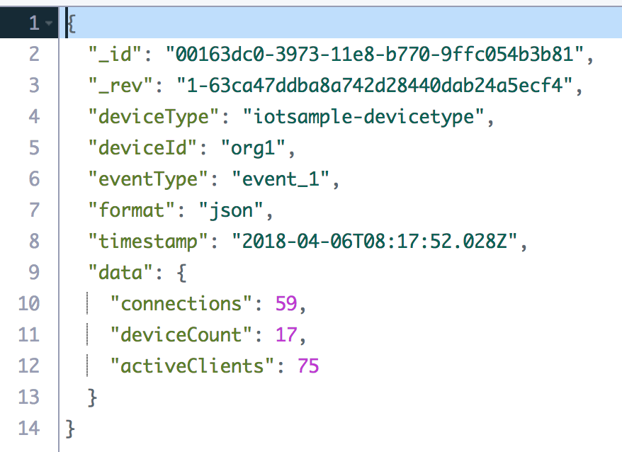
</p>


## 4. (Option 2) Populate Cloudant DB with sample dataset

To quickly view IoT device data across days, this repository contains sample datasets.  In the [sample_datasets](sample_datasets) folder we will see two datesets, for the month of [January](sample_datasets/January) and [March](sample_datasets/March). These contain ten days of data with a json datafile for each day.  These files are populated with sample data from IBM Watson IoT Platform for particular devices.  

This data can be can be populated into your Cloudant DB through the script [write_json_to_cloudant.py](sample_datasets/write_json_to_cloudant.py).


In a directory of your choice, first clone the repo:
```
git clone https://github.com/IBM/iot-device-trend-analysis
```

Next update the script with you Cloudant credentials and to the dataset you want to load

* Edit the script to [add your Cloudant credentials](sample_datasets/write_json_to_cloudant.py#L10)
  ```
  #cloudant credentials
  serviceUsername = ""
  servicePassword = ""
  serviceURL = ""
  ```

* Update the script to [choose the dataset](sample_datasets/write_json_to_cloudant.py#L15) you want to load between `January` or `March`

* Edit to [choose appropriate dates](sample_datasets/write_json_to_cloudant.py#L18). This should be among the dates for which the data is present in the dataset.

Now you can run the script. Navigate to the sample_datasets folder, and run the script.
```
cd sample_datasets/
python write_json_to_cloudant.py
```

This should populate your Cloudant with a database for each day emulating the IoT device data obtained from IBM Watson IoT Platform.

<p align="center">
  
</p>

## 5. Run the web application

Once the setup is complete with data coming into our Cloudant DB, we can run the application to start viewing the device data values and look for trends. To run the application, we will clone the repo, add the Cloudant credentials and then run the application through terminal.

#### Clone the repo

In a directory of your choice, if you have not, first clone the repo:
```
git clone https://github.com/IBM/iot-device-trend-analysis
```

#### Configure .env file

Create a `.env` file in the root directory of your clone of the project repository by copying the sample `.env.example` file using the following command:

  ```none
  cp .env.example .env
  ```

You will need to update the `.env` file with credentials for the Cloudant DB which you created.

The `.env` file will look something like the following:

  ```none
  #Cloudant NoSQL database
  CLOUDANT_USERNAME=
  CLOUDANT_PASSWORD=
  CLOUDANT_URL=
  ```

#### Run the application


Now you are ready to run your application. Go into this project's root directory
+ Run `pip install -r requirements.txt` to install the app's dependencies
+ Run `python run.py`
+ Access the running app in a browser at <http://localhost:5000/>

<p align="center">
  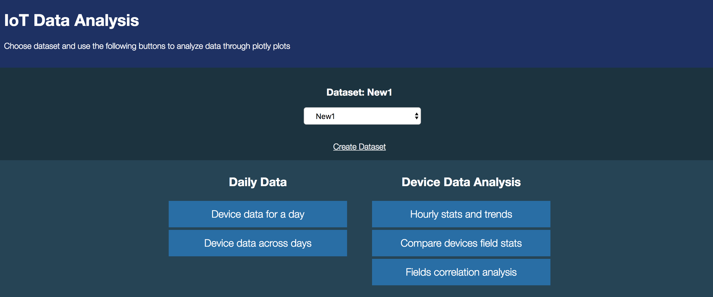
</p>

## 6. About the application

The application is designed to create dataset from our Cloudant DB which we would like to plot and analyze, and then analyze through plots based on user inputs.  The application provides to view the raw data and view analysis on the data including trends and statistical plots. In this section, we will look at creating dataset, analyzing the data through plots and look at the code.


#### Create dataset

Before analyzing the data, you will need to define a dataset. This includes dates and device Ids from your Cloudant storage.  You can do this through the app by going to `Create Dataset` link on the main page.  This pulls all the `dates` and `deviceIds` directly from the Cloudant database.  You can make selection for these fields and give a name to your dataset.

<p align="center">
  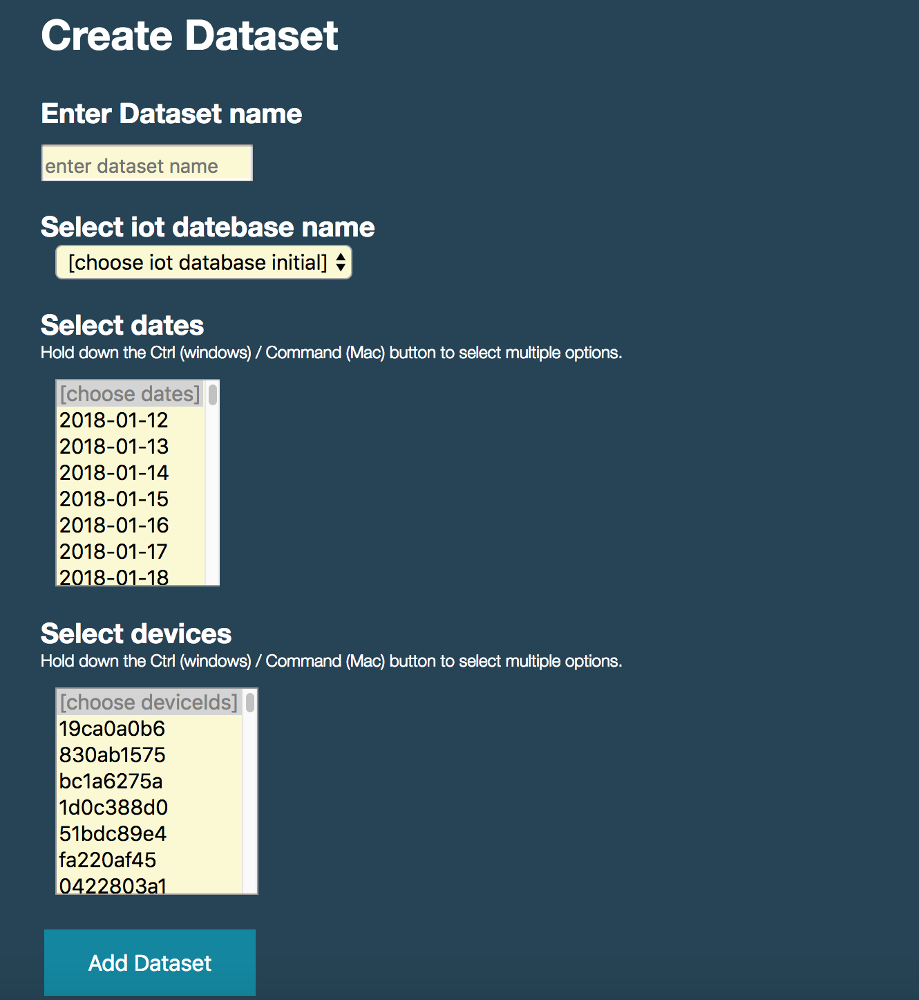
</p>


Or you can manually edit the `datasets.json` to fill in your database info with dates, deviceIDs, IoT database initial and name for the dataset. The file should look like below:
```
{
  "currentDataset": "New1",
  "datasets": [
    {
      "databaseName": "iotp_nmghmm_default_",
      "dataset": "New1",
      "dates": [
        "2018-01-28",
        "2018-01-29",
        "2018-01-30"
      ],
      "deviceIds": [
        "830ab1575",
        "bc1a6275a",
        "1d0c388d0",
        "51bdc89e4"
      ]
    }
  ]
}
```

#### Analyze the data

Once you have defined your dataset, you are ready to analyze your data through the different options present on the homepage. Each analysis will ask for device(s) and date(s) to generate the plot. Once your plot is generated, you can explore different Plotly interactive options on the top right which can allow to download the plot, change the plot type and other actions.  The `Hourly Stats and Trends` options will allow to view how the hourly max, min, and average are behaving across time, with trend analysis showing change in the values per hour.

<p align="center">
  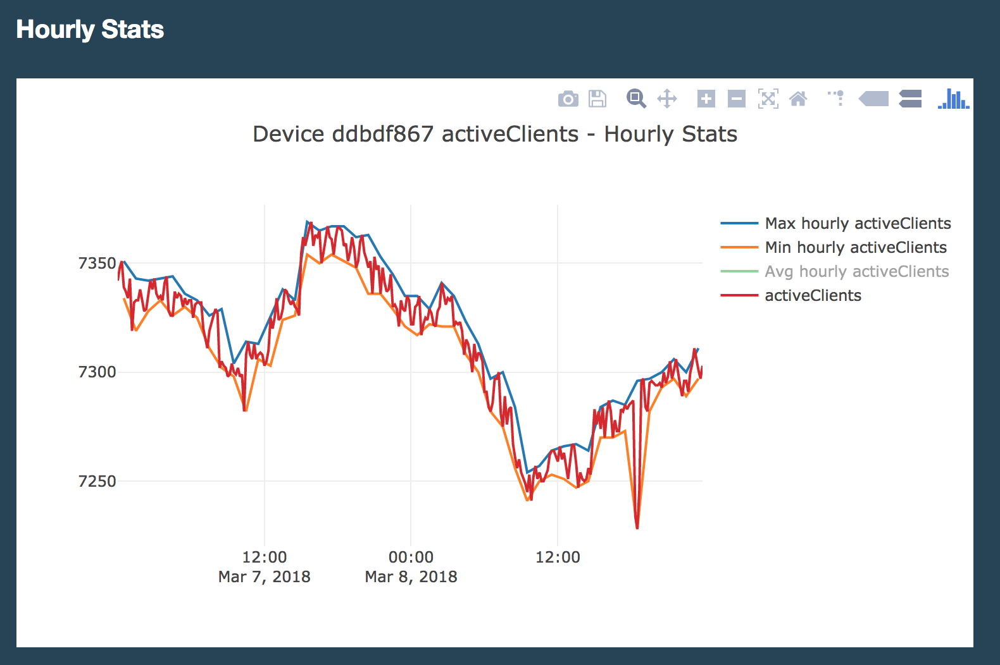
</p>

#### Code Structure

This web application is built using Python Flask framework. The repo consists of Python functions to retrieve the JSON data from Cloudant DB, and Javascript frontend to use the Plotly.js library.  Here we'll give a summary of the code files in the repo.

* `run.py`:  This routes the pages on the web application and manages all the `GET` and `POST` commands made using Ajax on the Javascript scripts.  These calls will then call the respective functions in `plotdata` or `dataset` library to return the requested data to the web frontend.

* `plotdata.py`:  This library contains functions that pulls  data from Cloudant DB through API call and parses the data according to the function and input. These functions will return a list of JSON objects, where each object will have `timeStamp` field and data fields that we are interested in plotting.  This library includes functions such as `Device_data_across_days` which pull raw data per device id for a start and end date, and `Hourly_stats_trends` which will create a JSON to plot the hourly stats and trends

For example the JSON object for `Device_data_across_days` will be as follow with the raw data:
```
{
    "deviceCount": 85.0,
    "timeStamp": "2018-01-16T10:35:41.635Z",
    "connections": 43.0,
    "deviceID": "19ca0a0b6",
    "activeClients": 65.0
}
```
The `Hourly_stats_trends` function will return JSON object with the max, min, average, and change in these value for every hour (i.e slope).  In addition it provides a time stamp for that hour right at 30 mins as the middle point for that hour.
```
{
    "sumActiveClients": 253.0,
    "plotTimeStamp": "2018-01-16T01:30:00.000Z",
    "maxActiveClients": 84.0,
    "date": "2018-01-16",
    "avgSlopeLastHour": -22.4,
    "minActiveClients": 26.0,
    "maxSlopeLastHour": -18.0,
    "hour": "01",
    "minSlopeLastHour": -9.0,
    "countEntries": 5,
    "avgActiveClients": 50.6,
    "deviceID": "19ca0a0b6"
}
```

* `dataset.py`:  This library provides functions to manage `datasets.json`, which includes pulling dataset information, adding dataset and setting the active dataset.  The functions updates and retrieve the `datasets.json` file accordingly.

* `JS scripts (i.e static/scripts/deviceDataPerDay.js)`: There is a JS script for each page of this application. The javascript makes `GET` calls to update the page with dropdown options, ensures valid user input for the page, and makes the Ajax call to get the JSON data to plot.  Then it uses Plotly.js library to create a plot for that page.

To create Plotly.js plots, we will first create traces for the plot, defining our `x` and `y` axis, and `type` and `name` for the trace. The `type` determines what type of plot we would like i.e scatter, bar, boxplot.  Next, we define `data` for the plots, as an array of these traces, and `layout` with the title for plot.
```
//define traces
var activeClientsTrace = {
  x: timeStampArray,
  y: activeClientsArray,
  type: "scatter",
  name: "activeClients"
};
var deviceCountTrace = {
  x: timeStampArray,
  y: deviceCountArray,
  type: "scatter",
  name: "deviceCount",
  visible: "legendonly"
};
var connectionsTrace = {
  x: timeStampArray,
  y: connectionsArray,
  type: "scatter",
  name: "connections",
  visible: "legendonly"
};
var data = [activeClientsTrace, deviceCountTrace, connectionsTrace];
var layout = {
  title: "Device " + id + " from " + startDate + " to " + endDate
};
```

With your `data` and `layout` defined, you are ready to call the `Plotly` library to create the plot. The `plotly_div1` would be an `id` in your `html` page.
```
//create plot
Plotly.newPlot('plotly_div1', data, layout)
  .then(
    function(gd) {
      Plotly.toImage(gd, {
        height: 500,
        width: 500
      })
    });
```


* `html (i.e /templates/devicePerDay.html)`: The html code is provided for each page, which is primarily to retrieve user input and display plots.  It provides the css and JS with the ids and class for enhancing display and capturing user inputs.


## 7. Deploy application to IBM Cloud

To deploy the application to IBM Cloud, you will need Cloud Foundary CLI installed, so you can use command-line to deploy the application. The configuration for the deployment will be in `manifest.yml` file, which we'll update first.

#### Update manifest.yml

Here we will update the `manifest.yml` file in the folder and replace with a unique name for your application. The name that you specify determines the application's URL, such as `your-application-name.mybluemix.net`. Additionally - update the service names so they match what you have in IBM Cloud. The relevant portion of the `manifest.yml` file looks like the following:

```
applications:
- path: .
  memory: 256M
  instances: 1
  domain: mybluemix.net
  name: Iot-Analytics
  host: iot-device-analytics
  disk_quota: 1024M
  buildpack: python_buildpack
  services:
  - cloudant
```

The memory of 256M will allow you to run the application with the `Lite` plan. However as data gets larger with the retrieval, you may have to increase memory to 512M or 1024M.

#### Deploy using Cloud Foundry

To deploy the application to IBM Cloud, we will use Cloud Foundry CLI. First login to your cloud foundry account
```
cf login
```

Next, in the command line use cloud foundry command to push the application to IBM Cloud:
```
cf push
```
This will take a few minutes and then provide the status of deployment.  You can then go to the url to view the application.


## Extending the Code Pattern
This code pattern can be extended in several ways:
* Use for real world IoT device data
* Create predictive analysis for the data
* Update plots as device data streams into database

## Links
* [Demo on Youtube](https://youtu.be/AVD99LVwnKE)
* [IBM Watson IoT - Python library](https://github.com/ibm-watson-iot/iot-python)
* [Using IBM Watson Analytics to visualize data from Watson IoT Platform](https://developer.ibm.com/recipes/tutorials/using-ibm-watson-analytics-to-visualize-data-from-watson-iot-platform/)
* [Using IBM Watson Studio for Iot analysis](https://developer.ibm.com/recipes/tutorials/visualizing-and-understanding-data-from-ibm-watson-iot-platform-by-using-ibm-data-science-experience/)
* [Create devices on IoT Platform](https://developer.ibm.com/recipes/tutorials/how-to-register-devices-in-ibm-iot-foundation/)
* [Simulate device data](https://console.bluemix.net/docs/services/IoT/devices/device_sim.html#sim_device_data)
* [Plotly.js reference](https://plot.ly/javascript/reference/)


## Troubleshooting
To troubleshoot your IBM Cloud application, use the logs. To see the logs, run:

```bash
cf logs <application-name> --recent
```

# License

[Apache 2.0](LICENSE)
